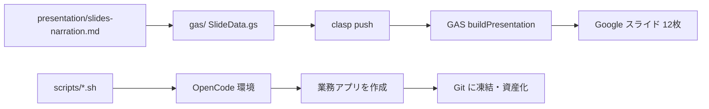

# 業務改善は固定費で — OpenCode 実践パッケージ

[](LICENSE)

流行りの AI エージェントへの丸投げに警鐘を鳴らしつつ、**固定費で作り、固まったらアプリに凍結する**ためのプレゼン資料・スライド自動生成・セットアップスクリプトをまとめたリポジトリです。

Cursor だけでは足りない場面に向けて、**OpenCode** を使った第二のルート（NVIDIA 無料 → Go / ローカル LLM）も提示します。

---

## コンセプト

| やらないこと | やること |
|-------------|---------|
| 毎回エージェントに業務を丸投げ | 繰り返す仕事を小さなアプリに凍結 |
| 従量課金のブラックボックス依存 | 作る段階は定額・無料・ローカルで固定費化 |
| ノウハウをチャット履歴に埋もれさせる | README 付きで Git に資産として残す |

### 進め方（3 段階）

```
Stage 0（今すぐ・無料）     OpenCode + NVIDIA 無料 LLM
        ↓
Stage 1（継続・固定費）   OpenCode Go  または  OpenCode + ローカル LLM
        ↓
Stage 2（本丸）           1仕事1アプリに凍結。日常はエージェントなしで実行
```

OpenCode は **資産を作る工場**。日常の業務本体を毎日エージェントに預けないのが原則です。

---

## ディレクトリ構成

```
open_code/
├── README.md                          ← このファイル
├── presentation/
│   └── slides-narration.md            プレゼン原稿（見出し・ナレーション・ビジュアル案）
├── gas/                               Google スライド自動生成（clasp + GAS）
│   ├── README.md                      GAS の詳細手順
│   ├── .gas_env.example               URL 設定テンプレート
│   ├── sync-env.js                    .gas_env → ID 自動反映
│   ├── push.ps1 / push.sh             sync + clasp push
│   ├── Code.gs / Config.gs / ...
│   └── SlideData.gs / SlideBuilder.gs
└── scripts/                           OpenCode セットアップスクリプト
    ├── README.md                      スクリプトの詳細
    ├── setup-opencode-nvidia.sh       Stage 0: 無料
    ├── setup-opencode-go.sh           Stage 1-A: 月額固定
    └── setup-opencode-local-llm.sh    Stage 1-B: ローカル LLM
```

---

## クイックスタート

### 聴衆・参加者 — OpenCode を試す

```bash
cd scripts

# まず無料で試す
bash setup-opencode-nvidia.sh

# 継続するなら（どちらか）
bash setup-opencode-go.sh
bash setup-opencode-local-llm.sh
```

実行後:

```bash
cd /path/to/your-project
opencode
/init
```

詳細は [scripts/README.md](scripts/README.md) を参照。

### 発表者 — Google スライドを生成する

#### 1. 初回セットアップ

```bash
npm install -g @google/clasp
clasp login
```

#### 2. 自分のスライド / GAS の URL を設定

```bash
cd gas
cp .gas_env.example .gas_env
# .gas_env を編集（スライド URL と GAS エディタ URL を貼り付け）
```

#### 3. push

```powershell
# PowerShell
.\push.ps1
```

```bash
# Git Bash / macOS / Linux
bash push.sh
# または
npm run push
```

#### 4. スライドを生成

1. GAS エディタを開く（`.gas_env` の `googleslide_gaseditor_url`）
2. 関数 `buildPresentation` を実行  
   またはスライド画面の **プレゼン生成 → スライドを再生成**

> **注意**: 既存スライドはすべて削除され、12 枚が再生成されます。

詳細は [gas/README.md](gas/README.md) を参照。

---

## 各コンポーネント

### プレゼン原稿（`presentation/`）

[slides-narration.md](presentation/slides-narration.md) に全 12 枚分の以下を記載しています。

- 見出し・箇条書き
- ナレーション全文
- ビジュアル案（スライドレイアウトのワイヤー）
- Q&A 想定

### Google スライド自動生成（`gas/`）

`slides-narration.md` の内容をもとに、Google Apps Script でスライドを自動生成します。

| ファイル | 役割 |
|---------|------|
| `SlideData.gs` | 12 枚分のスライド定義 |
| `SlideBuilder.gs` | レイアウト描画 |
| `Config.gs` | テーマ色・プレゼン ID |
| `.gas_env` | 自分のスライド / GAS URL（git 管理外） |

図版・QR コード・スクリーンショットは生成後に手動で追加してください。

### セットアップスクリプト（`scripts/`）

聴衆がその日から動けるよう、OpenCode の環境構築を自動化するシェルスクリプトです。

| スクリプト | 向いている人 |
|-----------|-------------|
| `setup-opencode-nvidia.sh` | まず無料で試したい |
| `setup-opencode-go.sh` | 月額固定（約 $10/月）で続けたい |
| `setup-opencode-local-llm.sh` | 個人情報を外に出したくない |

対応環境: macOS / Linux / Git Bash / WSL

---

## ワークフロー全体像



---

## 注意事項

- **利用規約**: OpenCode および接続先 AI サービスの利用規約を守ってください
- **Claude OAuth**: Pro/Max のサブスクリプションを第三者ツールに流用しないでください
- **NVIDIA 無料枠**: 開発・試作向けです。毎日の業務実行の本体には使わないでください
- **`.gas_env`**: 個人の URL を含むため git 管理外です。`.gas_env.example` をコピーして使ってください
- **画像**: スライドのビジュアル（ターミナル画面・QR 等）は手動配置が必要です

---

## トラブルシュート（よくあるもの）

| 症状 | 対処 |
|------|------|
| `clasp push` 失敗 | `clasp login` → [gas/README.md](gas/README.md) |
| `sync-env.gs` 構文エラー | GAS エディタで `sync-env` を削除 → 再 push |
| `The object has no text` | 最新の `SlideBuilder.gs` を push 済みか確認 |
| `opencode: command not found` | 新しいターミナルを開く / PATH に `~/.local/bin` を追加 |
| 別のスライドに切り替えたい | `.gas_env` の URL を変更 → `npm run push` |

---

## 関連リンク

- [OpenCode](https://opencode.ai/)
- [OpenCode Go](https://opencode.ai/go)
- [NVIDIA NIM（無料枠）](https://build.nvidia.com/models)
- [clasp](https://github.com/google/clasp)

---

## ライセンス

このリポジトリのコード・スクリプト・ドキュメントは [MIT License](LICENSE) の下で公開されています。

OpenCode、NVIDIA、Google など外部サービスは、それぞれの利用規約に従ってください。
